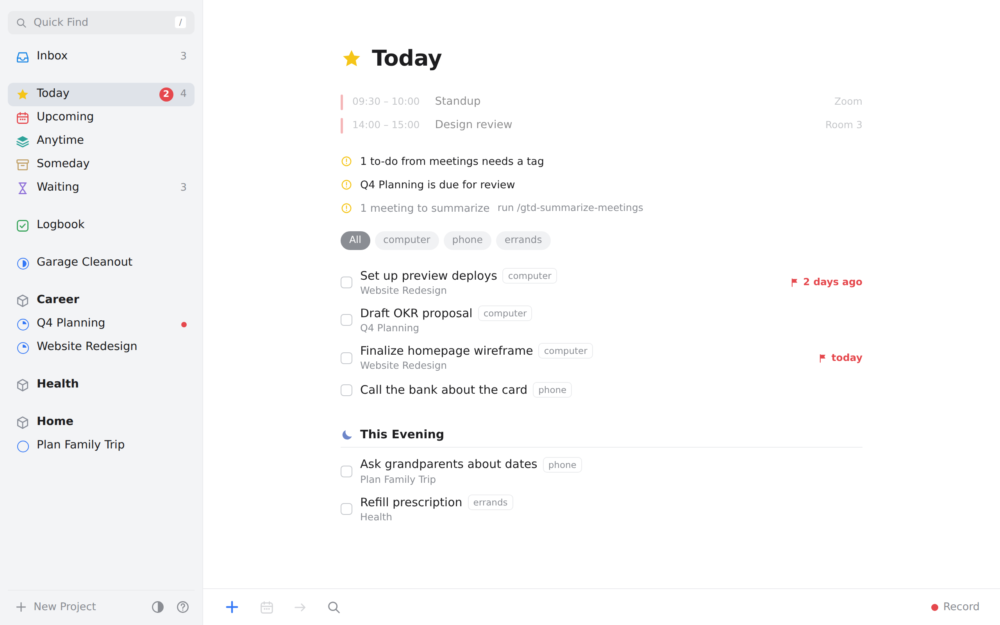
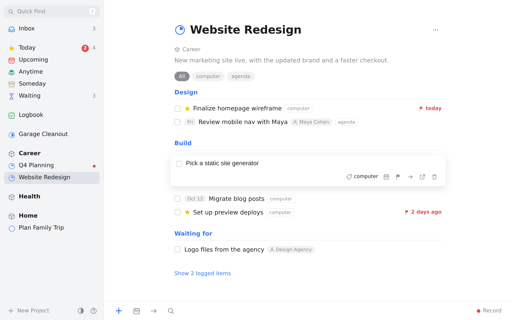
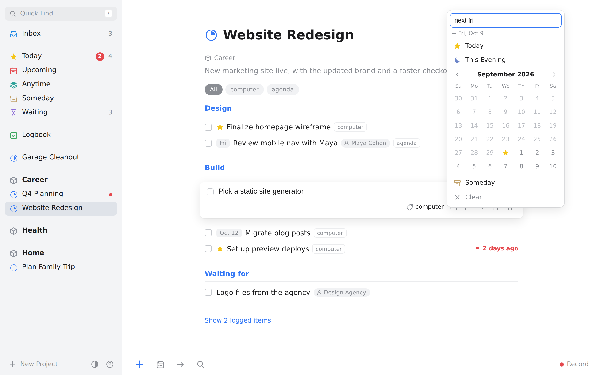
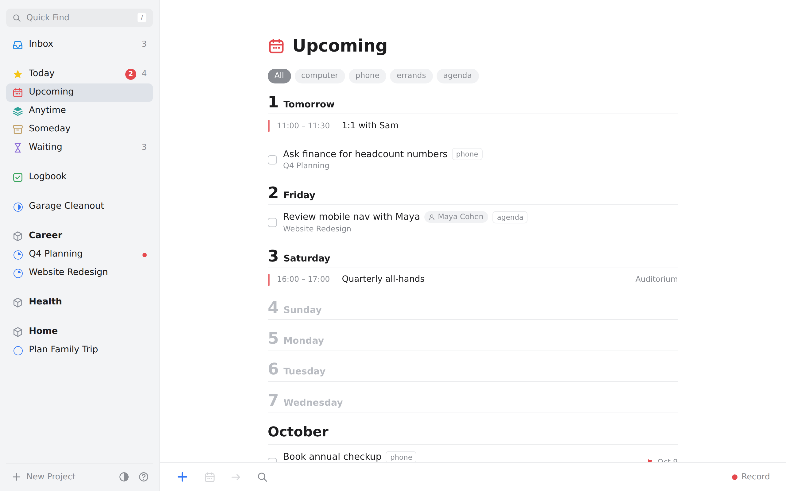
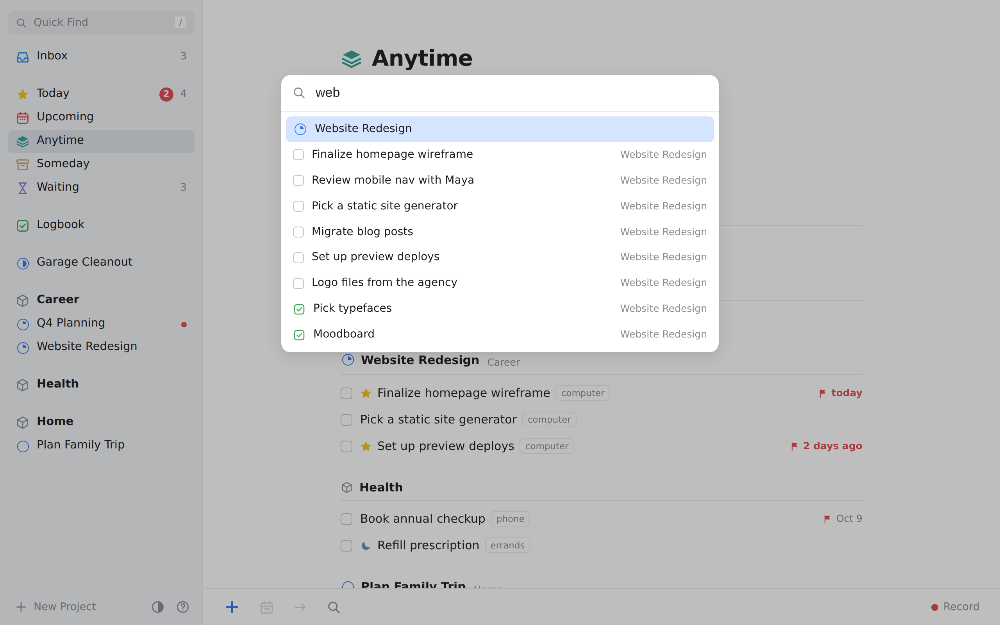
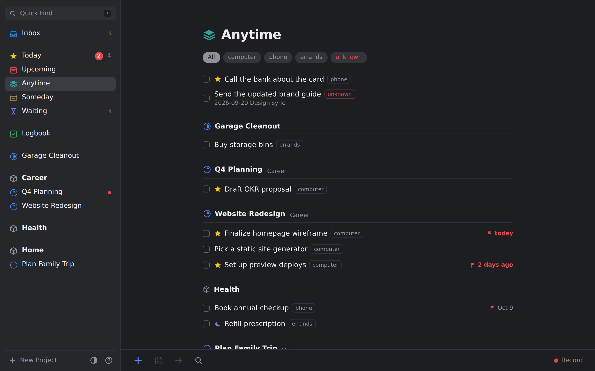
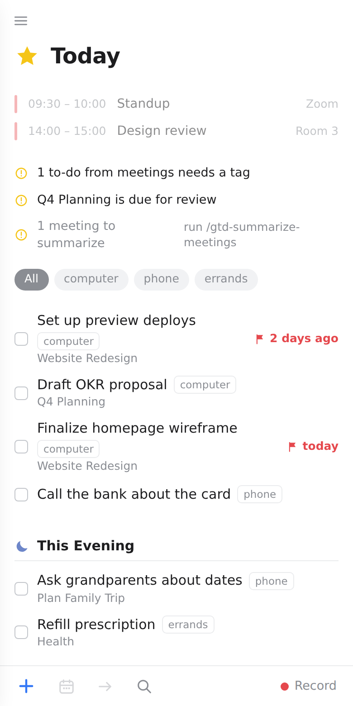

# 🧠 Second Brain

A **GTD (Getting Things Done) second brain** that is just a folder of markdown files. Open it as an
[Obsidian](https://obsidian.md) vault, run it as a [Things 3](https://culturedcode.com/things/)-style
app in your browser, or drive it with AI skills in Claude Code or opencode — all three read and write
the same files, so they never disagree.



## Why this exists

- **Plain markdown, all the way down.** A task is a checkbox line like
  `- [ ] Draft the Q3 proposal #next #computer [due:: 2026-10-20]`. No database, no lock-in, no
  sync service — your notes stay yours and work in any editor.
- **GTD without the busywork.** Capture in one keystroke, clarify the inbox with a guided skill,
  and let the weekly review walk you through every project.
- **Meetings become action items.** Record a meeting, transcribe it offline with the bundled
  `whisper.cpp`, and have its action items land on your lists.
- **Local and private.** The dashboard server listens only on `127.0.0.1`, transcription never
  leaves your machine, and recordings are git-ignored.

## The dashboard

`python scripts/dashboard_server.py` opens a Things 3–style app over the vault: **Inbox**, **Today**
(with **This Evening**), **Upcoming**, **Anytime**, **Someday**, **Waiting** and the **Logbook**,
with your projects grouped under their areas. Everything you do there — checking a box, setting a
date, moving a to-do to another project — is written straight back into the markdown.

| | |
| --- | --- |
|  |  |
| **Projects** — the note's `##` headings become sections; open a to-do to edit it in place. | **When** — Today, This Evening, a date, or Someday. Type "next fri", "in 3 days" or "oct 3". |
|  |  |
| **Upcoming** — the week ahead, day by day, with your Outlook meetings. | **Quick Find** (`/`) — jump to any list, project, tag or to-do. |

<p align="center">
  
  &nbsp;
  
</p>
<p align="center"><em>Dark mode, and the same app on a phone-sized window.</em></p>

It's fully keyboard-driven (`1`–`7` switch lists, `n` new to-do, `t`/`e`/`s` for Today/Evening/Someday,
`m` move, `/` find, `?` for the rest), and the shortcuts still work with a Hebrew keyboard layout.
Full guide: [`docs/gtd/local-dashboard.md`](docs/gtd/local-dashboard.md).

## Quick start

```bash
git clone https://github.com/adamkopelman/second-brain.git
cd second-brain

# 1. Scaffold (or repair) the vault structure — safe to re-run
python3 .claude/skills/gtd-setup/apply.py .

# 2. Start the browser dashboard, then open http://localhost:8787
python3 scripts/dashboard_server.py --no-outlook
```

Then, whichever you prefer:

- **Obsidian:** open the folder as a vault and accept "Trust author and enable plugins". Dataview and
  QuickAdd come vendored and pre-configured, so `Dashboard.md` works straight away
  ([plugins guide](docs/gtd/obsidian-plugins.md)). For AI skills inside Obsidian, install
  **Claudian** ([portability guide](docs/gtd/portability.md)).
- **Claude Code / opencode:** open the folder and run `/gtd-status` (Claude Code runs it for you at
  session start), then `/gtd-capture`, `/gtd-process-inbox` and so on.
- **Outlook (optional, Windows):** wire up the calendar and email — see
  [`docs/gtd/outlook.md`](docs/gtd/outlook.md). Drop `--no-outlook` to see your meetings in the dashboard.

## What's inside

| Surface | What it does |
| --- | --- |
| **Vault structure** | PARA folders (`00 Inbox`, `10 Projects`, `20 Areas`, `30 Resources`, `40 Archive`) + `Journal`, `People`, `Meetings`. State lives in tags + frontmatter. |
| **Browser dashboard** | `scripts/dashboard_server.py` — the Things 3–style app above, with full to-do editing and no Obsidian required. [Guide](docs/gtd/local-dashboard.md) |
| **Obsidian dashboard** | `Dashboard.md` — a KPI + card grid (Dataview JS) with a clickable Actions row (QuickAdd); `Dashboard (lists).md` is a no-JS fallback; `Home.canvas` is a spatial launchpad. [Guide](docs/gtd/html-dashboard.md) |
| **Portable snapshot** | `dashboard.html` — a self-contained, read-only page for any browser (`/gtd-dashboard`). |
| **Meeting recording** | 🎙️/💬 ribbon buttons in Obsidian, or **Record** in the browser dashboard. Transcribed offline with the vendored multilingual `whisper.cpp`; summarized into notes, decisions and action items by `/gtd-summarize-meetings`. [Guide](docs/gtd/meeting-recording.md) |
| **Outlook** | Flagged emails → inbox and calendar → weekly review via the vendored `outlook-mcp-rs` MCP server. [Guide](docs/gtd/outlook.md) |
| **Portability** | Skills in `.claude/skills/` work in Claude Code, opencode and Claudian; MCP config in `.mcp.json` + `opencode.json`. See [`AGENTS.md`](AGENTS.md). |

### Skills

| Skill | Use it to |
| --- | --- |
| `/gtd-setup` | Scaffold or repair the vault (idempotent). |
| `/gtd-capture` | Drop a thought, task or link into `00 Inbox/` without organizing it. |
| `/gtd-process-inbox` | Walk each inbox item through the GTD decision tree until the inbox is empty. |
| `/gtd-next-actions` | Answer "what should I do now?" — filtered by context, time or energy. |
| `/gtd-weekly-review` | Run the weekly review: get clear, get current, get creative. |
| `/gtd-status` | A read-only brief: inbox size, active projects, review recency, next actions. |
| `/gtd-maintain` | A health check: stuck projects, stale waiting-fors, overdue reviews, archive candidates. |
| `/gtd-dashboard` | Build the portable `dashboard.html`. |
| `/gtd-outlook` | Pull flagged Outlook email into the inbox, or the calendar into the review. |
| `/gtd-transcribe-meeting` | Transcribe pending recordings (and, on demand, summarize them). |
| `/gtd-summarize-meetings` | Turn transcripts into notes, decisions and action items. Safe to schedule. |

## How your data is stored

Everything the dashboard and skills show comes from these conventions (full spec:
[`30 Resources/GTD System.md`](30%20Resources/GTD%20System.md)):

```markdown
- [ ] Draft the Q3 proposal #next #computer [due:: 2026-10-20] [[Q3 Proposal]]
- [ ] Call the bank #next #phone [scheduled:: 2026-09-30] #evening
- [ ] Waiting on Sam for figures #waiting [[Sam Rivera]] [since:: 2026-09-08]
- [ ] Learn to sail #someday
- [x] Pay the electricity bill #next #computer [completion:: 2026-09-29]
```

| Convention | Meaning | In the dashboard |
| --- | --- | --- |
| `#computer` `#phone` `#errands` `#home` `#office` `#anywhere` `#agenda` `#unknown` | Context — where or with what you can do it | Tags, and the tag filter bar |
| `#next` · `#waiting` · `#someday` | Status | Anytime · Waiting · Someday |
| `[scheduled:: DATE]` | Don't show it before this date (tickler) | **When** → Today / Upcoming |
| `#evening` | Later today | **This Evening** |
| `[due:: DATE]` | Hard deadline | Red ⚑ flag, "3 days left" |
| `[since:: DATE]` | When you started waiting | Days waiting, on Waiting |
| `[completion:: DATE]` | Stamped when you check it off | Logbook |
| Project frontmatter `status:` / `area:` / `review:` | Active or someday, its area, next review | Sidebar, progress ring, review reminder |

## Requirements

- **Python 3** — the dashboard server and scripts use only the standard library.
- **A modern browser** for the dashboard (Chrome, Edge, Firefox or Safari).
- **Obsidian** (optional) — for the in-vault dashboards and recording buttons.
- **Windows** (optional) — only for the vendored Outlook MCP server and the `whisper.cpp`
  transcription build; everything else runs on macOS and Linux too.

## Project layout

```
00 Inbox/ … 40 Archive/, Journal/, People/, Meetings/   your vault (PARA + notes)
_templates/                  note templates: Project, Person, Meeting, Daily Note, Weekly Review
.claude/skills/              the gtd-* skills (plus general-purpose development skills)
scripts/dashboard_server.py  the browser dashboard's server  (+ dashboard_parser/_writer.py)
scripts/dashboard_static/    the browser dashboard's page (index.html, app.js, logic.js, style.css)
scripts/transcribe_meetings.py, build_dashboard.py, outlook_calendar.py
vendor/                      prebuilt outlook-mcp-rs and whisper.cpp (Windows x64)
docs/gtd/                    user guides        docs/superpowers/   design specs and plans
```

## Documentation

- [Local browser dashboard](docs/gtd/local-dashboard.md) — lists, keyboard, API, safety model
- [Obsidian & HTML dashboards](docs/gtd/html-dashboard.md) · [Obsidian plugins](docs/gtd/obsidian-plugins.md)
- [Meeting recording & transcription](docs/gtd/meeting-recording.md)
- [Outlook integration](docs/gtd/outlook.md)
- [Running in other harnesses](docs/gtd/portability.md) · [`AGENTS.md`](AGENTS.md)
- [GTD conventions](30%20Resources/GTD%20System.md)

## Development

```bash
pip install pytest
python3 -m pytest scripts/tests .claude/skills/gtd-setup/tests     # server, parser, writer, scripts
node --test scripts/dashboard_static/*.test.js                     # dashboard logic
```

Every write the dashboard makes re-reads the file and matches the exact line it's changing, so an
edit made in Obsidian a second earlier is never overwritten — the write is refused instead.
